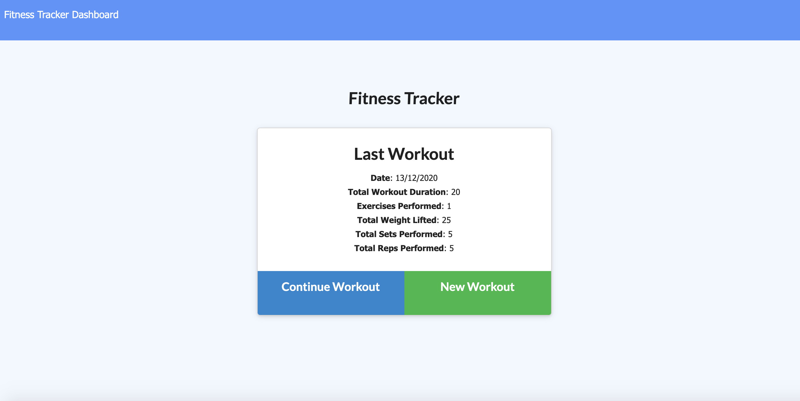
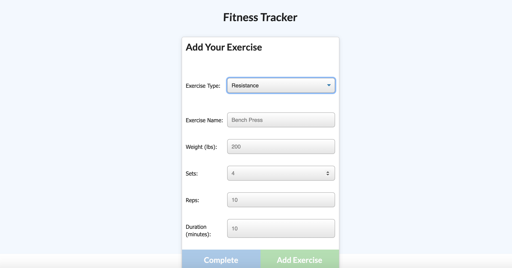
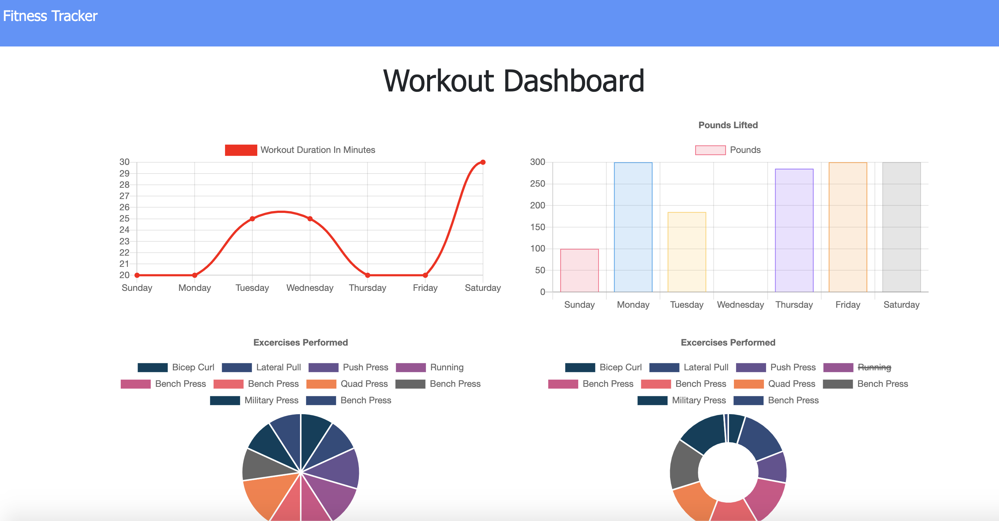

# Workout-Tracker

This application lets a user track and create daily workouts. The user can log multiple workouts for the one day and can also track by the name, type, weight, sets, reps and duration of the exercise.

## Contents

The application consists of 1 main page, server.js. It has a models folder which contains the model for mongodb. The public folder contains all the html and Javascript files for each page. It also has an images folder which has the images for the readme file. The routes folder contains the API routes and the HTML routes files. The seeders folder contains the seeds file. It also has a package.json file which stores the dependencies for the application.

## Usage

To use this application, git clone this repository. Once you have git cloned, run npm install to install the dependencies for the application which are:

- Express
- Mongoose
- Dotenv
- Morgan

The application can be invoked with npm start.

## User Story

As a user, I want to be able to view create and track daily workouts 
I want to be able to log multiple exercises in a workout on a given day 
I should also be able to track the name, type, weight, sets, reps, and duration of exercise 
If the exercise is a cardio exercise 
I should be able to track my distance traveled

## Screenshots

## Link to the deployed application

<a href="https://floating-mesa-38967.herokuapp.com/">Link to the app</a>

## Built With

- VS Code
- Terminal
- Mongoose
- Express

## License

MIT License

Copyright (c) 2020 Chloe Blackwell

Permission is hereby granted, free of charge, to any person obtaining a copy
of this software and associated documentation files (the "Software"), to deal
in the Software without restriction, including without limitation the rights
to use, copy, modify, merge, publish, distribute, sublicense, and/or sell
copies of the Software, and to permit persons to whom the Software is
furnished to do so, subject to the following conditions:

The above copyright notice and this permission notice shall be included in all
copies or substantial portions of the Software.

THE SOFTWARE IS PROVIDED "AS IS", WITHOUT WARRANTY OF ANY KIND, EXPRESS OR
IMPLIED, INCLUDING BUT NOT LIMITED TO THE WARRANTIES OF MERCHANTABILITY,
FITNESS FOR A PARTICULAR PURPOSE AND NONINFRINGEMENT. IN NO EVENT SHALL THE
AUTHORS OR COPYRIGHT HOLDERS BE LIABLE FOR ANY CLAIM, DAMAGES OR OTHER
LIABILITY, WHETHER IN AN ACTION OF CONTRACT, TORT OR OTHERWISE, ARISING FROM,
OUT OF OR IN CONNECTION WITH THE SOFTWARE OR THE USE OR OTHER DEALINGS IN THE
SOFTWARE.

## Author

Chloe Blackwell 
Email: chloeblackwell2@hotmail.com
